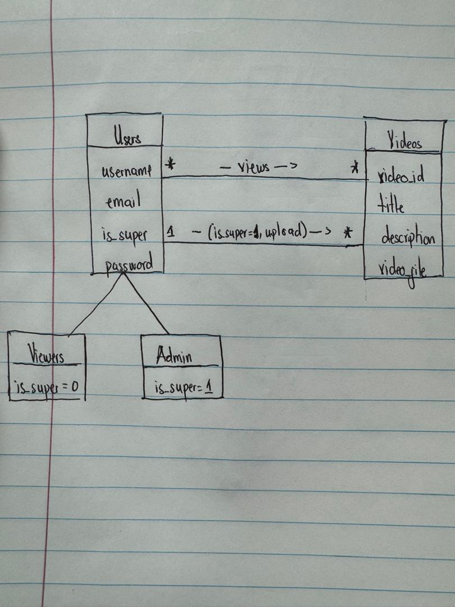

# Video Platform Project

## Overview

This project is a video platform web application designed to meet specific customer and admin requirements. The application allows users to sign up, log in, and navigate through video pages, while administrators can upload videos with titles and descriptions. The platform includes features such as video navigation, sharing links, and password recovery.

## Tech Stack

- **Frontend**: HTML, CSS, JavaScript
- **Backend**: Django
- **Database**: PostgreSQL
- **Hosting**: Railway

## Features

### Customer Requirements

1. **User Authentication**
    - Signup & login with email and password.
    - Account verification.
    - Password reset feature to recover lost passwords.

2. **Video Navigation**
    - Navigate through video pages with next and previous buttons.
    - Control video playback with common control buttons.

3. **Video Sharing**
    - Share links to videos on different pages.

### Admin Requirements

1. **Video Upload**
    - Upload videos with a title and description.

### Video Page Features

1. **Single Video Display**
    - Present only one video per page.

2. **Navigation Buttons**
    - Next and previous buttons to load new pages with different videos.
    - Hide previous button if there are no previous videos.
    - Hide next button if there are no further videos.

3. **Video Controls**
    - Common control buttons for video playback.

4. **Business Logo**
    - Display the business logo prominently at the top.

5. **Share Button**
    - Share button to allow users to share links to the current video page.

## Functionality and Endpoints

### User Authentication

- **Signup**: `/signup/`
- **Login**: `/login/`
- **Password Reset Request**: `/request-password-reset/`
- **Password Reset**: `/reset-password/`

### Video Navigation

- **Video Page**: `/videos/`
- **Next Video**: `/videos/<next_video_id>/`
- **Previous Video**: `/videos/<previous_video_id>/`

### Video Sharing

- **Share Video**: Shareable link generated on each video page.

### Admin Features

- **Upload Video**: `/upload-video/`

### Links

- **Home Page**: [Railway Deployed Link](https://web-production-78d12.up.railway.app/)
- **Repository**: [GitHub Repository](https://github.com/omar-basheer/Video-Platform)

## ER Diagram

